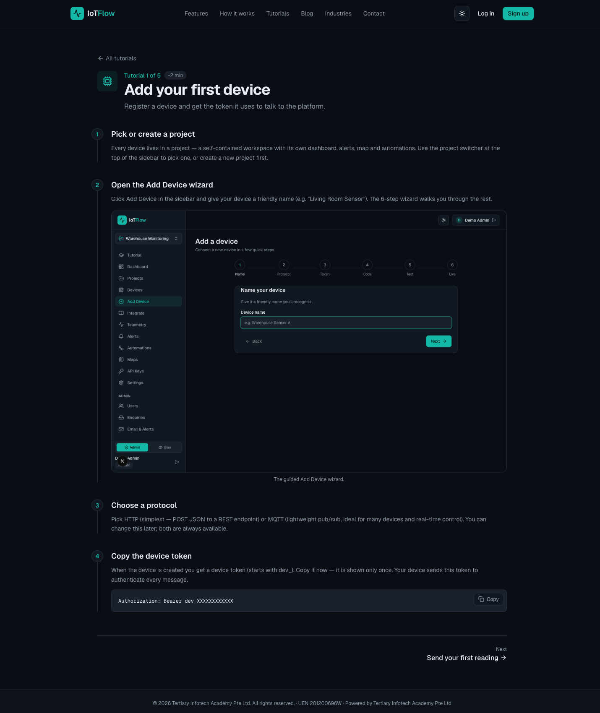
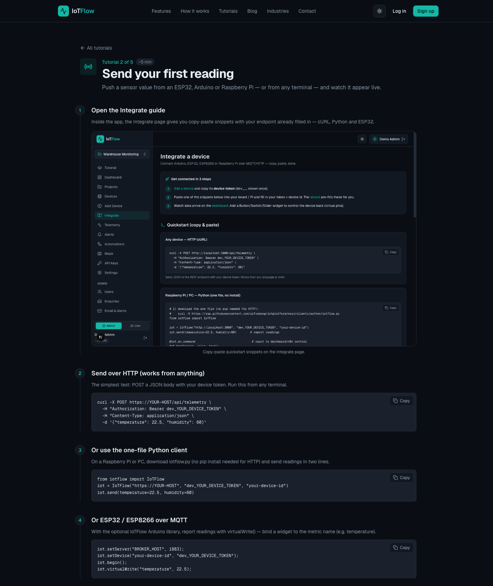
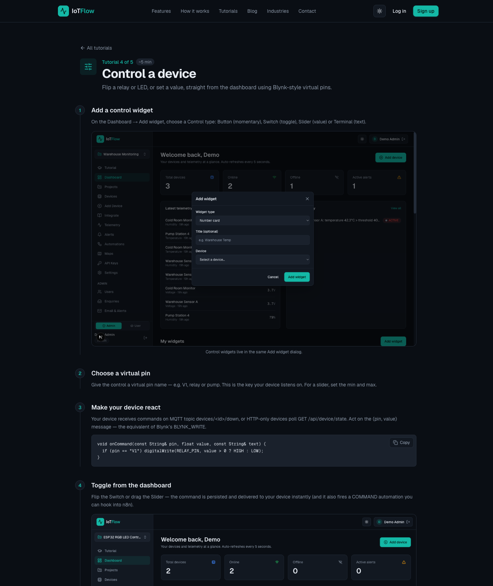
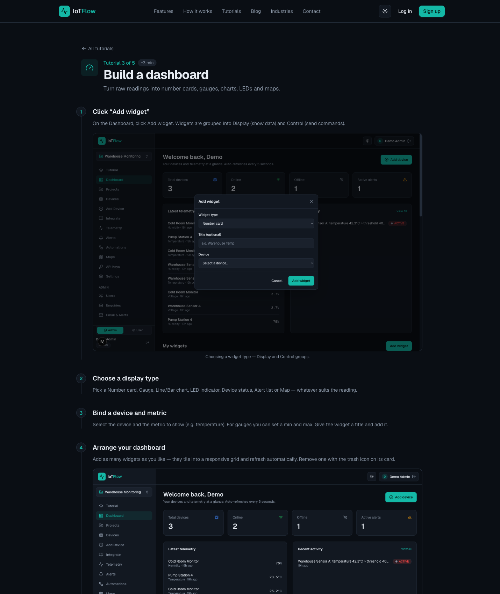
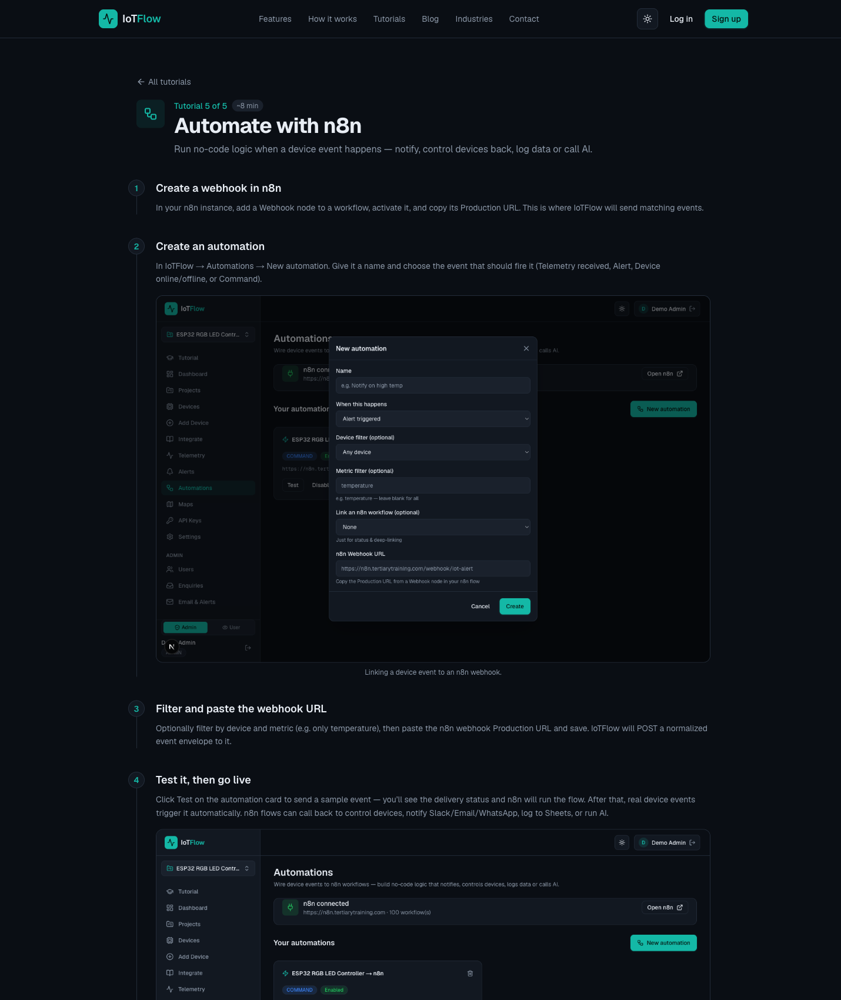

# Internet of Things (IoT) Fundamental for Beginners — Learner Guide

**WSQ Course Code:** TGS-2020504020  |  **Conducted by:** Tertiary Infotech Academy Pte Ltd (UEN 201200696W)  |  **Version v14 · 6 July 2026**

**IoT platform:** https://iot.tertiaryinfotech.com  |  **Course page:** https://www.tertiarycourses.com.sg/wsq-internet-of-things-iot-fundamental-for-beginners.html

## Contents

- [Introduction](#introduction)
- [Skills Framework](#skills-framework)
- [Course Learning Outcomes](#course-learning-outcomes)
- [Key IoT Concepts at a Glance](#key-iot-concepts-at-a-glance)
- [Before You Start — IoTFlow Platform Setup](#before-you-start--iotflow-platform-setup)
- [Topic 01 — Overview of Internet of Things (IoT)  (A1, K1, K4)](#topic-01--overview-of-internet-of-things-iot--a1-k1-k4)
- [Topic 02 — Collect and Post Data to Cloud  (A2, K3)](#topic-02--collect-and-post-data-to-cloud--a2-k3)
  - [Lab 1 — Register Your First Device on IoTFlow](#lab-1--register-your-first-device-on-iotflow)
  - [Lab 2 — Send Sensor Readings to the Cloud (HTTP & MQTT)](#lab-2--send-sensor-readings-to-the-cloud-http--mqtt)
- [Topic 03 — Read Data and Remote Control from Cloud  (A3, K2)](#topic-03--read-data-and-remote-control-from-cloud--a3-k2)
  - [Lab 3 — Read Device Data from the Cloud (REST API & MQTT)](#lab-3--read-device-data-from-the-cloud-rest-api--mqtt)
  - [Lab 4 — Remote Control a Device with Dashboard Virtual Pins](#lab-4--remote-control-a-device-with-dashboard-virtual-pins)
- [Topic 04 — IoT Data Analytics and Visualization  (A4, K5, K6)](#topic-04--iot-data-analytics-and-visualization--a4-k5-k6)
  - [Lab 5 — Build a Real-Time IoT Dashboard](#lab-5--build-a-real-time-iot-dashboard)
  - [Lab 6 — Automate with n8n — Triggers, Workflows and AI](#lab-6--automate-with-n8n--triggers-workflows-and-ai)
- [After the Course](#after-the-course)
- [Glossary](#glossary)


## Introduction

This Learner Guide accompanies the WSQ course Internet of Things (IoT) Fundamental for Beginners (TGS-2020504020), conducted by Tertiary Infotech Academy Pte Ltd. It provides step-by-step instructions for all 6 hands-on labs, organised by the four course topics. Every lab runs on our IoT platform IoTFlow (https://iot.tertiaryinfotech.com) and mirrors an official platform tutorial (https://iot.tertiaryinfotech.com/tutorials), so you can repeat the same steps any time after class.

Use this guide alongside the course slides and the lab files in the labs/ folder of the course repository. No hardware is required — every lab can be completed with cURL or Python from any terminal — but an ESP32/ESP8266 or Raspberry Pi makes the experience real.

Course page: https://www.tertiarycourses.com.sg/wsq-internet-of-things-iot-fundamental-for-beginners.html


## Skills Framework

This course is mapped to the Skills Framework TSC Internet of Things Application (PTP-TEM-3002-1.1).

**TSC Abilities**

- A1: Conduct briefings on the uses and functions of IoT technologies adopted by the organisation
- A2: Review IoT testing results and identify areas for improvement
- A3: Integrate information from multiple data sources
- A4: Review data to produce insights of business value

**TSC Knowledge**

- K1: Concept of Internet of Things (IoT)
- K2: Types and functionalities of IoT devices
- K3: Types of circuits and sensors within devices
- K4: Types of wireless communication technologies
- K5: Data analytics techniques
- K6: Concept of cybersecurity


## Course Learning Outcomes

- LO1: Understand the uses and functions of IoT technologies
- LO2: Post sensor data to cloud for IoT review
- LO3: Control devices from cloud data sources
- LO4: Data analytics and visualization on cloud to gain business insight


## Key IoT Concepts at a Glance

- **Devices** — Hardware — sensors, gadgets, appliances and machines — that collect and exchange data over the internet.
- **Sensors** — The input side: they measure a physical quantity (temperature, humidity, motion, gas, light).
- **Actuators** — The output side: relays, motors, pumps, valves and LEDs that act on the physical world.
- **Triggers** — Rules that turn readings into events — a threshold crossed or a device going offline fires an action.
- **n8n automation** — A low-code workflow tool: device events fire flows that notify, log, call AI or control devices back.
- **Workflows** — Chains of n8n nodes wired together — each node does one job (trigger, transform, notify, store, AI).
- **AI** — AI nodes inside workflows summarise readings, detect anomalies and recommend actions — analytics with zero code.
- **Dashboard for control** — Web/mobile panels of widgets: display widgets show data; control widgets write virtual pins to command devices.


## Before You Start — IoTFlow Platform Setup

**What you need**

- A free account on IoTFlow — sign up at https://iot.tertiaryinfotech.com.
- A modern browser. The dashboard is an installable PWA that also works on your phone.
- Optional hardware: ESP32 / ESP8266 / Raspberry Pi with a DHT temperature-humidity sensor.
- Access to an n8n instance for Lab 6 (cloud or self-hosted).

**How the platform works**

- Connect — flash the wizard snippet to your ESP32 / Arduino / Pi. It streams data over MQTT or HTTP.
- Visualise & Control — compose a dashboard of charts, gauges, buttons & sliders, on web and mobile.
- Automate with n8n — device events fire n8n flows that notify, control devices back, log data or call AI.

**Install the IoTFlow Python client (pip install iotflow)**

The official Python client connects any device that runs Python (Raspberry Pi, PC, Mac, Linux SBCs) to the platform. For microcontrollers (Arduino, ESP8266, ESP32) use the Arduino library — both speak the same protocol. Install it once before Lab 2:

1. Open a terminal (macOS/Linux: Terminal; Windows: Command Prompt or PowerShell) and check that Python 3 is installed.

   ```
   python --version    # or: python3 --version
   ```

2. Install the client with MQTT support (recommended for this course).

   ```
   pip install "iotflow[mqtt]"
   ```

3. Alternative — HTTP-only install (zero dependencies) if pip cannot reach paho-mqtt.

   ```
   pip install iotflow
   ```

4. Verify the installation — the import must succeed silently.

   ```
   python -c "from iotflow import IoTFlow; print('iotflow OK')"
   ```


Package on PyPI: https://pypi.org/project/iotflow/  ·  Source, README and examples: https://github.com/alfredang/iotplatform/tree/main/clients/python

**The telemetry_upload.py example script (used in Lab 2)**

This is the Python equivalent of the ESP8266_Telemetry_Upload Arduino sketch — it connects to the MQTT broker and publishes a reading every 10 seconds. Download it, fill in your broker host, device id and device token from the Add Device wizard, then run it:

```
curl -O https://raw.githubusercontent.com/alfredang/iotplatform/main/clients/python/examples/telemetry_upload.py
python telemetry_upload.py
```

```
import random
import time

from iotflow import IoTFlow

# ---- MQTT broker ----
# Use the course platform broker. (For a self-hosted broker on your LAN,
# use that machine's IP instead — find it with `ipconfig` / `ifconfig`.)
MQTT_BROKER = "iot.tertiaryinfotech.com"
MQTT_PORT = 1883

# ---- Device identity (from the "Add Device" wizard in IoTFlow) ----
DEVICE_ID = "test-device"
DEVICE_TOKEN = "dev_XXXXXXXXXXXXXXXXXXXXXXXXXXXXXXXX"

PUBLISH_INTERVAL_S = 10

iot = IoTFlow(
    token=DEVICE_TOKEN,
    device_id=DEVICE_ID,
    mqtt_host=MQTT_BROKER,
    mqtt_port=MQTT_PORT,
)
iot.connect()  # MQTT connection runs in the background
print(f"Connected to MQTT broker {MQTT_BROKER}:{MQTT_PORT}")

while True:
    # TODO: replace with real sensor readings (DHT22, BME280, ADC, ...)
    temperature = round(28.5 + random.uniform(-1.0, 1.0), 1)
    humidity = round(65 + random.uniform(-5.0, 5.0), 1)
    voltage = 3.7

    iot.mqtt_publish(temperature=temperature, humidity=humidity, voltage=voltage)
    print(f"Published: temperature={temperature} humidity={humidity} voltage={voltage}")
    time.sleep(PUBLISH_INTERVAL_S)
```

> **Note:** Example script on GitHub: https://github.com/alfredang/iotplatform/blob/main/clients/python/examples/telemetry_upload.py — the Arduino original it mirrors: https://github.com/alfredang/iotplatform/blob/main/clients/arduino/IoTFlow/examples/ESP8266_Telemetry_Upload/ESP8266_Telemetry_Upload.ino

**Conventions used in every lab**

- Your device token (dev_...) is shown ONCE at registration — store it safely and never share it.
- Every API call authenticates with the header:  Authorization: Bearer dev_XXXXXXXXXXXX
- MQTT broker: iot.tertiaryinfotech.com, port 1883.  REST endpoint: /api/telemetry.
- Python code uses the official client: pip install "iotflow[mqtt]" — send()/virtual_write() over HTTP, connect()/mqtt_publish() over MQTT, @on_command for control.
- Each lab mirrors a platform tutorial at https://iot.tertiaryinfotech.com/tutorials — revisit them any time.


## Topic 01 — Overview of Internet of Things (IoT)  (A1, K1, K4)

What is IoT · Devices, Sensors & Actuators · Triggers · Wireless Technologies · Use Cases

**Key concepts**

- IoT is the network of physical devices embedded with sensors, software and connectivity that collect and exchange data over the internet.
- A device senses the world with sensors (input) and acts on it with actuators (output) — a trigger turns a reading into an event that starts an action.
- Wireless technologies (Wi-Fi, Bluetooth, Zigbee, LoRaWAN, NB-IoT, 5G) connect constrained devices to the cloud.
- IoT powers smart homes, agriculture, healthcare, manufacturing, logistics, retail and smart cities.

> **Note:** This topic is delivered through concepts, diagrams and trainer demonstrations — the hands-on labs begin in Topic 02.


## Topic 02 — Collect and Post Data to Cloud  (A2, K3)

Cloud & IoT Platforms · IoTFlow · Device Registration · MQTT & HTTP Telemetry

**Key concepts**

- The cloud stores and processes IoT data at scale — devices stream telemetry to an IoT platform instead of a single computer.
- IoTFlow (iot.tertiaryinfotech.com) is our low-code IoT platform: connect ESP32/Arduino/Pi over MQTT or HTTP, visualise, control and automate.
- Every device authenticates with a device token (Authorization: Bearer dev_...) issued once at registration.
- Telemetry is a simple JSON document of metric key-value pairs, e.g. {"temperature": 22.5, "humidity": 60}.
- Official device clients: the Python client — pip install iotflow — for Raspberry Pi/PC/Mac, and the Arduino library for ESP8266/ESP32; both speak the same protocol.
- The Python client sends with send()/virtual_write() over HTTP, streams with connect()/mqtt_publish() over MQTT, and reacts to commands with @on_command.


### Lab 1 — Register Your First Device on IoTFlow

Learning outcome: Post sensor data to cloud for IoT review — register a device (LO2).

Goal: The learner signs in to the IoTFlow platform, creates a project workspace, runs the Add Device wizard, chooses a protocol (HTTP or MQTT) and obtains the device token used to authenticate every message the device sends.

**What you'll build**

A registered IoT device in your own IoTFlow project, with its device token saved   (Uses: IoTFlow projects, Add Device wizard, device tokens, MQTT & HTTP protocols.)



*Platform walkthrough for Lab 1 — Register Your First Device on IoTFlow*

**Step-by-step**

1. Open the IoTFlow platform and sign up for a free account (or log in).

   ```
   https://iot.tertiaryinfotech.com  →  Sign up  →  Log in
   ```

2. Pick or create a project — a self-contained workspace with its own dashboard, alerts, map and automations. Use the project switcher at the top of the sidebar.
3. Click Add Device in the sidebar and give your device a descriptive name.

   ```
   Device name:  Living Room Sensor
   ```

4. Follow the six-step guided wizard and choose a protocol: HTTP — simplest, POST JSON to a REST endpoint; or MQTT — lightweight pub/sub, ideal for many devices and real-time control. Both remain available later.
5. Copy the device token shown when the device is created — it is displayed only once.

   ```
   dev_XXXXXXXXXXXX
   ```

6. Understand how the token authenticates every message your device sends.

   ```
   Authorization: Bearer dev_XXXXXXXXXXXX
   ```


**Test it**

The new device appears in your project's device list, and the Integrate page shows code snippets pre-filled with your endpoint and device token.

> **Note:** This lab mirrors the platform tutorial at https://iot.tertiaryinfotech.com/tutorials/add-your-first-device — the full lab sheet is labs/lab-01-register-your-first-device-on-iotflow.md in the course repository.

---


### Lab 2 — Send Sensor Readings to the Cloud (HTTP & MQTT)

Learning outcome: Post sensor data to cloud for IoT review — send telemetry (LO2).

Goal: The learner pushes sensor values to the IoTFlow telemetry API three ways — cURL from any terminal, the Python client, and an ESP32/ESP8266 over MQTT — and watches the readings appear live on the dashboard.

**What you'll build**

Live temperature & humidity telemetry streaming into IoTFlow from terminal, Python and ESP32   (Uses: Telemetry REST API, Python client (pip install iotflow), ESP32/ESP8266 Arduino library, MQTT broker (port 1883).)



*Platform walkthrough for Lab 2 — Send Sensor Readings to the Cloud (HTTP & MQTT)*

**Step-by-step**

1. Open the Integrate page for your device — every snippet comes pre-filled with your endpoint and device token.
2. Send your first reading from any terminal with cURL (HTTP POST).

   ```
   curl -X POST https://iot.tertiaryinfotech.com/api/telemetry \
     -H "Authorization: Bearer dev_XXXXXXXXXXXX" \
     -H "Content-Type: application/json" \
     -d '{"temperature": 22.5, "humidity": 60}'
   ```

3. Open the Dashboard — the reading appears under Latest Telemetry within seconds (widgets auto-refresh every 5 s).
4. Install the official IoTFlow Python client from PyPI (https://pypi.org/project/iotflow/).

   ```
   pip install "iotflow[mqtt]"      # with real-time MQTT (paho-mqtt)
   pip install iotflow               # HTTP only — zero dependencies
   ```

5. Send readings from Python over HTTP — several metrics at once with send(), or one at a time with virtual_write().

   ```
   from iotflow import IoTFlow
   
   iot = IoTFlow("https://iot.tertiaryinfotech.com", "dev_XXXXXXXXXXXX", "living-room-sensor")
   iot.send(temperature=22.5, humidity=60)      # several metrics at once
   iot.virtual_write("temperature", 22.5)       # or one at a time
   ```

6. Stream continuously over MQTT with the telemetry_upload.py example — download it, fill in your broker host, device id and device token, then run it.

   ```
   curl -O https://raw.githubusercontent.com/alfredang/iotplatform/main/clients/python/examples/telemetry_upload.py
   # edit: MQTT_BROKER = "iot.tertiaryinfotech.com", DEVICE_ID, DEVICE_TOKEN
   python telemetry_upload.py
   ```

7. Study the loop inside telemetry_upload.py — connect() runs MQTT in the background and mqtt_publish() sends a reading every 10 seconds.

   ```
   iot = IoTFlow(token=DEVICE_TOKEN, device_id=DEVICE_ID,
                 mqtt_host=MQTT_BROKER, mqtt_port=MQTT_PORT)
   iot.connect()                    # MQTT runs in the background
   while True:
       iot.mqtt_publish(temperature=temperature, humidity=humidity, voltage=3.7)
       time.sleep(PUBLISH_INTERVAL_S)
   ```

8. Hardware alternative: flash the ESP8266_Telemetry_Upload Arduino sketch — the Arduino library speaks the same protocol as the Python client. Confirm the values update live on the dashboard.

   ```
   IoTFlow.virtualWrite("temperature", t);   // metric name binds to dashboard widgets
   ```


**Test it**

Each value you send appears in the Dashboard's Latest Telemetry within seconds, and the device's telemetry history grows with every reading.

> **Note:** This lab mirrors the platform tutorial at https://iot.tertiaryinfotech.com/tutorials/send-your-first-reading — the full lab sheet is labs/lab-02-send-sensor-readings-to-the-cloud-http-mqtt.md in the course repository.

---


## Topic 03 — Read Data and Remote Control from Cloud  (A3, K2)

Read via REST API & MQTT · Virtual Pins · Dashboard Control · Alerts & Triggers

**Key concepts**

- Reading from the cloud integrates data sources: REST GET for state and history, MQTT subscribe for real-time push.
- Virtual pins (V1, relay, pump ...) are named keys that dashboard control widgets write to — buttons, switches, sliders and terminals.
- Devices receive downlink commands on the MQTT topic devices/<id>/down, or by HTTP-polling GET /api/device/state.
- Alert rules fire on metric thresholds or device-offline, and can hand off to an n8n automation.


### Lab 3 — Read Device Data from the Cloud (REST API & MQTT)

Learning outcome: Control devices from cloud data sources — read data (LO3).

Goal: The learner reads device data back out of the cloud — the latest state over the REST API, real-time messages by subscribing to the device's MQTT topics, and per-device telemetry history on the platform — integrating data from multiple sources.

**What you'll build**

A terminal and Python session reading live device state and streaming MQTT messages   (Uses: REST API (GET /api/device/state), MQTT subscribe (devices/<id>/down), telemetry history.)


*Platform walkthrough for Lab 3 — Read Device Data from the Cloud (REST API & MQTT)*

**Step-by-step**

1. Read your device's latest state from any terminal over the REST API.

   ```
   curl https://iot.tertiaryinfotech.com/api/device/state \
     -H "Authorization: Bearer dev_XXXXXXXXXXXX"
   ```

2. Inspect the JSON reply — the platform returns the current value of every metric and virtual pin.
3. Subscribe to your device's MQTT downlink topic to watch commands and data arrive in real time.

   ```
   mosquitto_sub -h iot.tertiaryinfotech.com -p 1883 \
     -u device -P dev_XXXXXXXXXXXX -t "devices/<id>/down" -v
   ```

4. Send a fresh reading (Lab 2) and watch it flow through — uplink telemetry vs downlink commands.
5. Open the device page on IoTFlow and review its per-device telemetry history and active alerts.
6. Read the same state from Python and print the values — this is how any external app integrates IoT data.

   ```
   r = requests.get(f"{host}/api/device/state",
       headers={"Authorization": f"Bearer {token}"})
   print(r.json())
   ```


**Test it**

The REST call returns the same values shown on the dashboard, and the MQTT subscription prints messages the moment they are published.

> **Note:** This lab mirrors the platform tutorial at https://iot.tertiaryinfotech.com/tutorials — the full lab sheet is labs/lab-03-read-device-data-from-the-cloud-rest-api-mqtt.md in the course repository.

---


### Lab 4 — Remote Control a Device with Dashboard Virtual Pins

Learning outcome: Control devices from cloud data sources — remote control (LO3).

Goal: The learner adds Control widgets (button, switch, slider, terminal) bound to virtual pins, implements the device-side command handler, and flips a relay/LED live from the dashboard — Blynk-style two-way control.

**What you'll build**

A dashboard switch and slider that control a relay/LED on the device in real time   (Uses: Control widgets (Button, Switch, Slider, Terminal), virtual pins, Python client @on_command, MQTT downlink, HTTP polling.)



*Platform walkthrough for Lab 4 — Remote Control a Device with Dashboard Virtual Pins*

**Step-by-step**

1. On the Dashboard click Add widget and choose a Control type: Button (momentary), Switch (toggle), Slider (value) or Terminal (text).
2. Assign the virtual pin the widget writes to — e.g. V1, relay or pump. For a slider also set the min/max range.

   ```
   Virtual pin:  V1
   ```

3. Understand the downlink path — devices receive commands via MQTT on their command topic, or by HTTP polling.

   ```
   MQTT topic:  devices/<id>/down      HTTP:  GET /api/device/state
   ```

4. React to commands in Python with the iotflow client — decorate a handler with @iot.on_command and poll over HTTP (no extra dependencies).

   ```
   from iotflow import IoTFlow
   
   iot = IoTFlow("https://iot.tertiaryinfotech.com", "dev_XXXXXXXXXXXX", "living-room-sensor")
   
   @iot.on_command
   def handle(pin, value, text):
       if pin == "V1":
           print("relay ->", value)      # drive a GPIO here
   
   iot.run(interval=3)                   # blocks, polls every 3 s
   ```

5. For real-time control, use the same handler over MQTT — loop_forever() keeps the connection open so commands arrive instantly.

   ```
   iot = IoTFlow(token="dev_XXXXXXXXXXXX", device_id="living-room-sensor",
                 mqtt_host="iot.tertiaryinfotech.com", mqtt_port=1883)
   
   @iot.on_command
   def handle(pin, value, text): ...
   
   iot.loop_forever()
   ```

6. Hardware alternative: implement the same handler in the Arduino sketch and map pins to GPIO outputs.

   ```
   void onCommand(const String& pin, float value, const String& text) {
     if (pin == "V1") digitalWrite(RELAY_PIN, value > 0 ? HIGH : LOW);
   }
   ```

7. Flip the switch and move the slider on the dashboard — commands are delivered to the device immediately; the relay/LED responds. The same events can also trigger automations (Lab 6).

**Test it**

Toggling the dashboard switch changes the relay/LED state within a second, and the slider value arrives in your @on_command handler as you drag it.

> **Note:** This lab mirrors the platform tutorial at https://iot.tertiaryinfotech.com/tutorials/control-a-device — the full lab sheet is labs/lab-04-remote-control-a-device-with-dashboard-virtual-pins.md in the course repository.

---


## Topic 04 — IoT Data Analytics and Visualization  (A4, K5, K6)

Dashboards & Widgets · n8n Workflow Automation · AI Analytics · IoT Cybersecurity

**Key concepts**

- Dashboards turn raw readings into number cards, gauges, line/bar charts, LED indicators and maps that auto-refresh.
- n8n is a low-code workflow automation tool: a device event triggers a flow of nodes that notify, log, call AI or control devices back.
- AI nodes in a workflow summarise readings, detect anomalies and generate recommendations — analytics with zero code.
- IoT security matters because the cyber and physical worlds converge: spoofing, tampering, eavesdropping, DoS and elevation of privilege.


### Lab 5 — Build a Real-Time IoT Dashboard

Learning outcome: Data analytics and visualization on cloud — dashboards (LO4).

Goal: The learner turns raw readings into a live dashboard — number cards, gauges, line/bar charts, LED indicators, device status and maps — arranged on a responsive grid that auto-refreshes.

**What you'll build**

A monitoring dashboard with a number card, gauge, chart, LED indicator and map   (Uses: Display widgets: number card, gauge, line/bar chart, LED, device status, alert list, map.)



*Platform walkthrough for Lab 5 — Build a Real-Time IoT Dashboard*

**Step-by-step**

1. On the Dashboard click Add widget — widgets are grouped into Display (show data) and Control (send commands).
2. Add a Number card: select your device, choose the metric (temperature) and give the widget a title.
3. Add a Gauge for humidity and set sensible min/max bounds (e.g. 0–100 %).
4. Add a Line chart to plot the temperature history over time.
5. Add an LED indicator (on/off state) and a Map widget if your device reports a location.
6. Arrange the layout — widgets snap into a responsive grid, refresh automatically, and can be removed with the trash icon.

**Test it**

Send fresh readings (Lab 2) and watch every widget — card, gauge and chart — update live within the 5-second auto-refresh.

> **Note:** This lab mirrors the platform tutorial at https://iot.tertiaryinfotech.com/tutorials/build-a-dashboard — the full lab sheet is labs/lab-05-build-a-real-time-iot-dashboard.md in the course repository.

---


### Lab 6 — Automate with n8n — Triggers, Workflows and AI

Learning outcome: Data analytics and visualization on cloud — n8n automation & AI insight (LO4).

Goal: The learner connects IoTFlow to n8n with a webhook, picks a trigger (telemetry, alert, online/offline, command), then builds a no-code workflow that notifies, logs to a sheet, calls AI for insight and even controls the device back.

**What you'll build**

An n8n workflow fired by device events: threshold alert → notify + log + AI summary   (Uses: IoTFlow Automations, n8n Webhook node, alert rules, Email/Telegram, Google Sheets, AI nodes.)



*Platform walkthrough for Lab 6 — Automate with n8n — Triggers, Workflows and AI*

**Step-by-step**

1. In n8n, add a Webhook node to a new workflow, activate the workflow, and copy the webhook's Production URL.
2. In IoTFlow, create a new Automation and choose the trigger type: telemetry received, alert fired, device online/offline, or command sent.
3. Optionally narrow the trigger by device and metric (e.g. only temperature), then paste the n8n webhook URL and save.
4. Create an alert rule on a threshold (e.g. temperature > 30) or device-offline, and hand it off to the automation.

   ```
   Alert rule:  temperature > 30  →  fire automation (n8n webhook)
   ```

5. Use Test to send a sample payload to n8n, inspect the JSON the webhook receives, then enable live triggering.
6. In n8n, branch the flow: send an Email/Telegram/WhatsApp notification and append the reading to Google Sheets.
7. Add an AI node to summarise the readings and recommend an action — AI-powered analytics with zero code.
8. Close the loop: add an HTTP Request node that sends a downlink command back to the device (e.g. switch a fan on).

   ```
   POST {host}/api/device/command   { "pin": "V1", "value": 1 }
   ```


**Test it**

Pushing a reading above the threshold fires the n8n flow: the notification arrives, a row is appended to the sheet, the AI summary is generated, and the device reacts to the command sent back.

> **Note:** This lab mirrors the platform tutorial at https://iot.tertiaryinfotech.com/tutorials/automate-with-n8n — the full lab sheet is labs/lab-06-automate-with-n8n-triggers-workflows-and-ai.md in the course repository.

---


## After the Course

- Your IoTFlow account and projects remain yours — keep experimenting at https://iot.tertiaryinfotech.com.
- Revisit the tutorials at https://iot.tertiaryinfotech.com/tutorials to repeat any lab.
- Connect a real ESP32 or Raspberry Pi at home using the Integrate page snippets.
- Extend your n8n flow: WhatsApp alerts, Google Sheets logging, AI agents.
- Assessment: WA (SAQ, 1 hour) + PP (practical, 1 hour), open book, on Day 2 from 4:30 pm.


## Glossary

- **IoT** — Internet of Things — the network of physical objects with sensors, software and connectivity that exchange data over the internet.
- **IIoT** — Industrial IoT — IoT applied to industrial sectors such as manufacturing and energy.
- **Telemetry** — The stream of metric readings a device sends to the cloud, as JSON key-value pairs.
- **Device token** — The secret (dev_...) issued once at registration that authenticates every message a device sends.
- **MQTT** — A lightweight publish/subscribe messaging protocol for constrained devices; a broker routes messages by topic.
- **REST API** — An HTTP interface — POST /api/telemetry to write data, GET /api/device/state to read it.
- **Uplink / Downlink** — Uplink = device → cloud telemetry. Downlink = cloud → device commands.
- **Virtual pin** — A named key (V1, relay, pump) that dashboard control widgets write to and device code reacts to — Blynk-style.
- **Widget** — A dashboard building block: number card, gauge, chart, LED, map (display) or button, switch, slider, terminal (control).
- **Trigger** — A rule that fires on an event — telemetry received, threshold crossed, device offline, command sent.
- **Alert rule** — A trigger on a metric threshold or device-offline that tracks active alerts and can hand off to n8n.
- **n8n** — A low-code workflow automation tool with 400+ integrations; flows start from a webhook and run nodes.
- **Webhook** — A URL that starts an n8n workflow when the platform POSTs an event payload to it.
- **Workflow** — A set of n8n nodes wired together that runs automatically on every trigger event.
- **AI node** — A workflow node that calls a language model to summarise, classify or recommend actions from your data.
- **PWA** — Progressive Web App — install the dashboard on your phone's home screen for mobile control.

---
*© 2026 Tertiary Infotech Academy Pte Ltd. All rights reserved. · www.tertiarycourses.com.sg*
