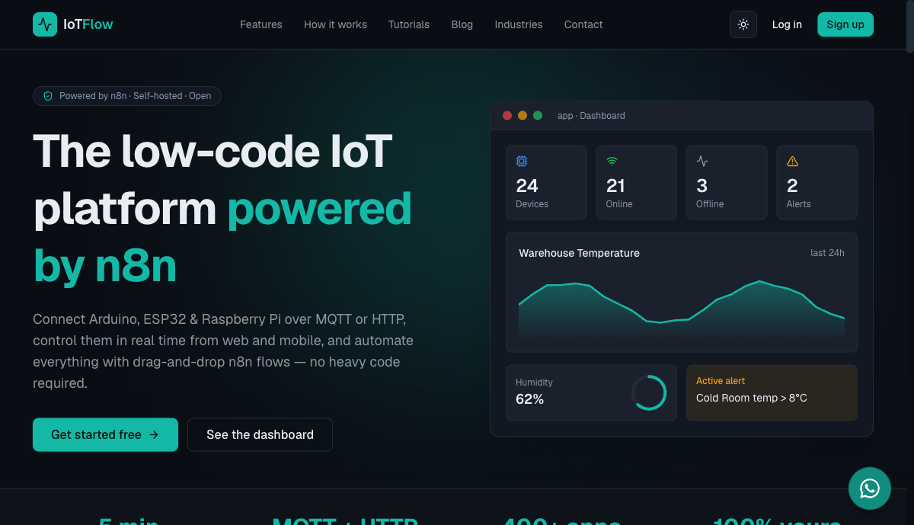

# TGS-2020504020 — Internet of Things (IoT) Fundamental for Beginners

WSQ courseware for the 2-day course **Internet of Things (IoT) Fundamental for Beginners**, conducted by **Tertiary Infotech Academy Pte Ltd** (UEN 201200696W).

[](https://www.tertiarycourses.com.sg/wsq-internet-of-things-iot-fundamental-for-beginners.html)
[](https://iot.tertiaryinfotech.com)
[](https://n8n.io)
[](https://iot.tertiaryinfotech.com/tutorials)

📋 **Course page:** <https://www.tertiarycourses.com.sg/wsq-internet-of-things-iot-fundamental-for-beginners.html>
🌐 **IoT platform used in all labs:** <https://iot.tertiaryinfotech.com> ([tutorials](https://iot.tertiaryinfotech.com/tutorials))



## What the course covers

Learners connect devices and sensors to the cloud, control them remotely, and automate everything — hands-on, on our own IoT platform **IoTFlow**:

- **Devices & sensors** — what IoT devices are, sensors (input) vs actuators (output), wireless technologies (Wi-Fi, BLE, Zigbee, LoRaWAN, NB-IoT, 5G).
- **Triggers** — turning readings into events: thresholds, device-offline rules and alert hand-offs.
- **Telemetry to the cloud** — device tokens, MQTT (managed broker) and HTTP REST (`/api/telemetry`).
- **Dashboards for control** — number cards, gauges, charts, LEDs and maps, plus Blynk-style **virtual pins** (buttons, switches, sliders) for live two-way control.
- **n8n automation & workflows** — device events fire drag-and-drop n8n flows that notify, log, control devices back…
- **AI** — …or call AI to summarise readings, detect anomalies and recommend actions.

## Skills Framework

| | |
|---|---|
| TSC | Internet of Things Application (PTP-TEM-3002-1.1) |
| LO1 | Understand the uses and functions of IoT technologies |
| LO2 | Post sensor data to cloud for IoT review |
| LO3 | Control devices from cloud data sources |
| LO4 | Data analytics and visualization on cloud to gain business insight |

## Repository structure

```
├── courseware/
│   ├── IoT-Fundamental-for-Beginners-v13.pptx   # Slide deck (146 slides)
│   ├── IoT-Fundamental-for-Beginners-v13.pdf    # Slide deck (PDF)
│   ├── LP-IoT-Fundamental-for-Beginners.docx    # Lesson Plan (2-day schedule)
│   ├── LP-IoT-Fundamental-for-Beginners.pdf     # Lesson Plan (PDF)
│   ├── LG-IoT-Fundamental-for-Beginners.docx    # Learner Guide (with screenshots)
│   ├── LG-IoT-Fundamental-for-Beginners.pdf     # Learner Guide (PDF)
│   └── assets/                                  # Diagrams + platform screenshots
├── LEARNER-GUIDE.md                             # Markdown mirror of the Learner Guide
├── labs/                                        # 6 hands-on labs (start at labs/README.md)
└── .claude/skills/courseware-build/             # Single-source generators (course_data.py drives everything)
```

## Hands-on labs

All labs run on [IoTFlow](https://iot.tertiaryinfotech.com) and mirror the official [platform tutorials](https://iot.tertiaryinfotech.com/tutorials). No hardware required — every lab works with cURL/Python from any terminal; an ESP32/ESP8266 makes it real.

| # | Lab | Topic |
|---|-----|-------|
| 1 | [Register Your First Device on IoTFlow](labs/lab-01-register-your-first-device-on-iotflow.md) | 02 — Collect & Post Data to Cloud |
| 2 | [Send Sensor Readings to the Cloud (HTTP & MQTT)](labs/lab-02-send-sensor-readings-to-the-cloud-http-mqtt.md) | 02 — Collect & Post Data to Cloud |
| 3 | [Read Device Data from the Cloud (REST API & MQTT)](labs/lab-03-read-device-data-from-the-cloud-rest-api-mqtt.md) | 03 — Read Data & Remote Control |
| 4 | [Remote Control a Device with Dashboard Virtual Pins](labs/lab-04-remote-control-a-device-with-dashboard-virtual-pins.md) | 03 — Read Data & Remote Control |
| 5 | [Build a Real-Time IoT Dashboard](labs/lab-05-build-a-real-time-iot-dashboard.md) | 04 — Analytics & Visualization |
| 6 | [Automate with n8n — Triggers, Workflows and AI](labs/lab-06-automate-with-n8n-triggers-workflows-and-ai.md) | 04 — Analytics & Visualization |

## Rebuilding the courseware

Everything is generated from a single source of truth (`course_data.py` + `data_labs.py` in the `courseware-build` skill), so the PPT, LP, LG and labs can never drift apart:

```bash
python3 .claude/skills/courseware-build/build_labs.py           # labs/*.md + labs/README.md
python3 .claude/skills/courseware-build/build_slides.py         # courseware/IoT-Fundamental-for-Beginners-v13.pptx
python3 .claude/skills/courseware-build/build_lesson_plan.py    # courseware/LP-*.docx
python3 .claude/skills/courseware-build/build_learner_guide.py  # courseware/LG-*.docx + LEARNER-GUIDE.md
```

Requires `python-pptx`, `python-docx` and `Pillow`.

## Acknowledgements

- [IoTFlow](https://iot.tertiaryinfotech.com) — the low-code IoT platform powering all labs.
- [n8n](https://n8n.io) — workflow automation engine for the IoT event flows.
- Course delivered by [Tertiary Infotech Academy Pte Ltd](https://www.tertiaryinfotech.com/) — see the [course page](https://www.tertiarycourses.com.sg/wsq-internet-of-things-iot-fundamental-for-beginners.html) to enrol.

---

© 2026 Tertiary Infotech Academy Pte Ltd. All rights reserved. · [www.tertiarycourses.com.sg](https://www.tertiarycourses.com.sg)
