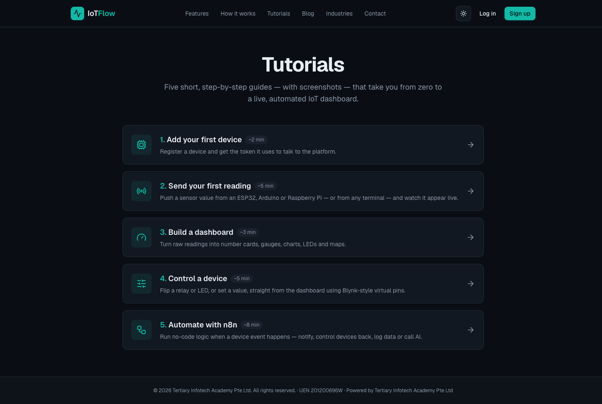

# Lab 3 — Read Device Data from the Cloud (REST API & MQTT)

**Course:** Internet of Things (IoT) Fundamental for Beginners (TGS-2020504020)
**Topic 03:** Read Data and Remote Control from Cloud  (A3, K2)
**Objective:** Control devices from cloud data sources — read data (LO3)
**Platform tutorial:** https://iot.tertiaryinfotech.com/tutorials

## Goal

The learner reads device data back out of the cloud — the latest state over the REST API, real-time messages by subscribing to the device's MQTT topics, and per-device telemetry history on the platform — integrating data from multiple sources.

## What you'll build

A terminal and Python session reading live device state and streaming MQTT messages

*Uses: REST API (GET /api/device/state), MQTT subscribe (devices/<id>/down), telemetry history.*



## Prerequisites

- An account on IoTFlow (https://iot.tertiaryinfotech.com) — created in Lab 1.
- A modern browser. Hardware (ESP32/ESP8266/Raspberry Pi) is optional — every lab can be completed with cURL/Python from any terminal.

- Your device token from Lab 1 (`dev_...`).

## Step-by-step

### Step 1 — Read your device's latest state from any terminal over the REST API.

```
curl https://iot.tertiaryinfotech.com/api/device/state \
  -H "Authorization: Bearer dev_XXXXXXXXXXXX"
```

### Step 2 — Inspect the JSON reply — the platform returns the current value of every metric and virtual pin.

### Step 3 — Subscribe to your device's MQTT downlink topic to watch commands and data arrive in real time.

```
mosquitto_sub -h iot.tertiaryinfotech.com -p 1883 \
  -u device -P dev_XXXXXXXXXXXX -t "devices/<id>/down" -v
```

### Step 4 — Send a fresh reading (Lab 2) and watch it flow through — uplink telemetry vs downlink commands.

### Step 5 — Open the device page on IoTFlow and review its per-device telemetry history and active alerts.

### Step 6 — Read the same state from Python and print the values — this is how any external app integrates IoT data.

```
r = requests.get(f"{host}/api/device/state",
    headers={"Authorization": f"Bearer {token}"})
print(r.json())
```

## Test it

The REST call returns the same values shown on the dashboard, and the MQTT subscription prints messages the moment they are published.

---
*© 2026 Tertiary Infotech Academy Pte Ltd. All rights reserved. · www.tertiarycourses.com.sg*
